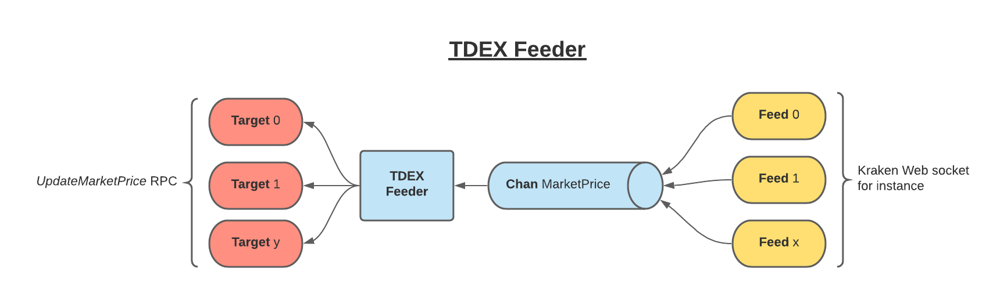

# tdex-feeder

Feeder allows to connect several price feeds to TDex Daemon(s) in order to automatically update the markets prices.

## Overview

tdex-feeder connects to exchanges and forwards market(s) price feeds to some tdex-daemon(s) by consuming its `UpdateMarketPrice` RPC.


## ⬇️ Run  Standalone

### Install

1. [Download the latest release for MacOS or Linux](https://github.com/tdex-network/tdex-feeder/releases)

2. Move the feeder into a folder in your PATH (eg. `/usr/local/bin`) and rename the feeder as `feederd`

3. Give executable permissions. (eg. `chmod a+x /usr/local/bin/feederd`)

4. Create [config.json](#config-file) file.

### Run
```sh
# Run with default config and default flags.
$ feederd

# Run with debug mode and different config path.
$ FEEDER_CONFIG_PATH=./config.json feederd 
```

## 🖥 Local Development

Below is a list of commands you will probably find useful.

### Build and Run with docker

Build and use `feederd` with docker.

#### Build feederd docker image

At the root of the repository
```
docker build --pull --rm -f 'Dockerfile' -t feederd:latest . 
```

#### Run the daemon

Create a [config.json](#config-file) file 
and run the following command in the same folder:
```
docker run -it --name feederd -v $HOME/config.json:/config.json --network="host" feederd
```
the `$HOME/config.json` is the path to the feederd configuration file. 

> `--net=host` in case you're running tdex-deamon locally

### Build it yourself

Build feeder as static binary and run the project with default configuration.

```sh
# build feeder as a static binary
$ make build

# run the binary on Linux
$ ./build/feederd-linux-amd64

# run the binary on MacOS
$ ./build/feederd-darwin-amd64
```

##### Config file

Rename the file `./config.example.json` into `./config.json` 
and adapt if for your specific purpose. The default example
uses kraken as price feeder and forwards the feeds related to the BTC/USDT market to a local daemon (with mac auth disabled).

NOTE: All entries of the JSON configuration file are mandatory if not otherwise expressed. Below you can find a brief explanation of the JSON object.

```
price_feeder: service where to source prices (only "kraken" available for now).
markets: list with necessary markets info.
  base_asset: hex string of the hash of the market base asset.
  quote_asset: hex string of the hash of the market quote asset.
  ticker: string of the corresponding feeder's market ticker.
  targets: list of daemons to update for every feed received on this market.
    rpc_address: string with hostname and port of the target daemon.
    tls_cert_path: string path of the TLS cert file to use to connect with the target daemon. Optional.
    macaroons_path: string path of the macaroon file to use to connect with the target daemon. Optional.
```